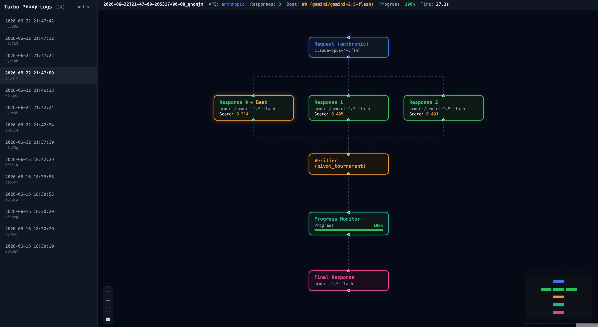

# Turbo Agent



Turbo Agent is the Claude Code plugin for LLM-as-a-Verifier. It implements an LLM API proxy that improves response quality through concurrent inference, verification, and refinement. It sits between your client (Claude Code, Codex, etc.) and the LLM provider, sending multiple parallel requests and selecting the best response with a **Probabilistic Pivot Tournament (PPT)** scored by a fine-grained logprob verifier.

```
Client request
    │
[Context Refinement]   (optional) rewrite/augment the system prompt for clarity
    │
[Concurrent Inference] send N parallel candidates to the backend model
    │
[Verification]         pivot tournament over the candidates, pick the best one
    │
Best response → Client
```

Verification uses the pivot tournament from the [`llm-verifier`](https://pypi.org/project/llm-verifier/) package to pick the best of `N` candidates.

## Install

```bash
pip install turbo-agent
```

Or from source:

```bash
pip install -e .
```

## Setup

For turbo agent to work, you need a `turbo-agent.yaml`. You can copy the reference file in this repo.

`turbo-agent.yaml` references keys with `$VAR_NAME` syntax. The recommended way to provide them is a `.env` file in the project root (next to `turbo-agent.yaml`) — the proxy loads it automatically on startup. Copy the committed template and fill in your keys:

```bash
cp .env.example .env
# then edit .env
```

```bash
# .env
VERTEX_API_KEY=your-vertex-key     # preferred for Gemini 2.5 logprobs (verifier)
# GEMINI_API_KEY=your-gemini-key     # used by gemini/ models (AI Studio)
# OPENAI_API_KEY=...               # only if you route to openai/ models
# ANTHROPIC_API_KEY=...            # only if you route to anthropic/ models
```

`.env` is gitignored; `.env.example` is committed as the template. Keys already
exported in your shell environment work too and take nothing extra. The verifier
and progress monitor use Gemini **logprobs**, which are best served by a Vertex
AI key (`VERTEX_API_KEY` + `provider: vertex_ai` in the config); a plain
`GEMINI_API_KEY` also works for the `gemini/` backend models.

Verify your keys are valid:

```bash
turbo-agent check
```

It checks every supported provider (Gemini, Vertex AI, DeepSeek, OpenAI, Anthropic) and reports each with ✅ / ❌ / ⚠️ / ⚪️, flagging which keys your config actually uses. The Vertex and DeepSeek checks also confirm the backend returns token logprobs, which the verifier needs.

## Run

```bash
turbo-agent                   # default port 8888
turbo-agent -p 9000           # custom port
```

### Use with Claude Code

```bash
ANTHROPIC_BASE_URL=http://localhost:8888 claude
```

### Use Claude as the backend model

Claude generates candidates like any other backend — put it under
`backend.models` with an `anthropic/` prefix:

```yaml
backend:
  models:
    - name: anthropic/claude-opus-4-5
      api_key: $ANTHROPIC_API_KEY
      num_candidates: 3
```

**Claude cannot be the verifier.** The fine-grained reward is an expectation
over the verifier's score-token distribution, and the Anthropic Messages API
returns no token logprobs — there is nothing to take an expectation over.
Configuring `anthropic/` under `verifier.model` raises an error rather than
failing somewhere downstream. Generate with Claude, verify with a logprob
backend (`deepseek/`, `openai/`, or `gemini/` on Vertex).

### Use with opencode

opencode reaches any OpenAI-compatible endpoint through a custom provider, so
no plugin is needed — point one at the proxy in `opencode.json`:

```json
{
  "$schema": "https://opencode.ai/config.json",
  "provider": {
    "turbo-agent": {
      "npm": "@ai-sdk/openai-compatible",
      "name": "Turbo Agent",
      "options": {
        "baseURL": "http://localhost:8888/v1",
        "apiKey": "unused"
      },
      "models": {
        "deepseek/deepseek-chat": { "name": "DeepSeek (verified)" }
      }
    }
  }
}
```

Run `turbo-agent` in one terminal, then `opencode` in another and pick the
model with `/models`.

Two things to know:

- The model id must match a `backend.models[].name` in your `turbo-agent.yaml`
  — that is what `GET /v1/models` reports. The proxy routes on its own config,
  not on the model in the request.
- With the verifier on, the proxy answers once the tournament has picked a
  winner, so the reply arrives as a single burst rather than token by token.
  Tool calls survive that replay intact; it is the latency that changes.

The proxy's `/v1/messages` endpoint works the same way if you would rather
point opencode's `anthropic` provider at it with a `baseURL` override. The
OpenAI-compatible route above is the easier one: a custom provider takes an
arbitrary model id, whereas the Anthropic provider caps output at 4096 tokens
for model ids it does not recognise unless you set an explicit `limit`.

### Use with other OpenAI-compatible clients

```bash
export OPENAI_API_BASE=http://localhost:8888/v1
```

## Configuration

Edit `turbo-agent.yaml`. API keys can reference environment variables with `$VAR_NAME` syntax. See the reference `turbo-agent.yaml` file for reference and usage.

### Model prefixes

| Prefix | Provider |
|--------|----------|
| `gemini/` | Google Gemini |
| `deepseek/` | DeepSeek |
| `openai/` | OpenAI |
| `anthropic/` | Anthropic |
| (none) | OpenAI-compatible endpoint |

The same prefixes select the **verifier** backend, except `anthropic/`. The verifier scores with
token logprobs, so it needs a backend that returns them: Gemini through Vertex
AI (`provider: vertex_ai`), DeepSeek through its hosted API, or any
OpenAI-compatible logprob server (vLLM, SGLang) via `base_url`.

```yaml
verifier:
  model:
    name: deepseek/deepseek-v4-flash
    api_key: $DEEPSEEK_API_KEY
```

```yaml
verifier:
  model:
    name: openai/Qwen3.5-9B          # or any served model id
    base_url: http://localhost:8000/v1
    api_key: $OPENAI_API_KEY
```

## API endpoints

| Endpoint | Format |
|----------|--------|
| `POST /v1/messages` | Anthropic |
| `POST /v1/chat/completions` | OpenAI |
| `GET /v1/models` | OpenAI |
| `GET /visualizer` | Pipeline visualizer UI |
| `*` | Upstream passthrough to api.anthropic.com |

## Visualizer

A built-in web UI at `http://localhost:8888/visualizer` shows the pipeline DAG for each request — context refinement, all candidate responses, the pairwise tournament comparisons and scores, and the final selection.

To build the frontend (requires Node.js):

```bash
cd frontend
yarn install
yarn build
```

## Publish to PyPI

```bash
cd frontend && yarn build && cd ..
pip install build twine
rm -rf dist
python -m build
twine check dist/*
twine upload dist/*
```